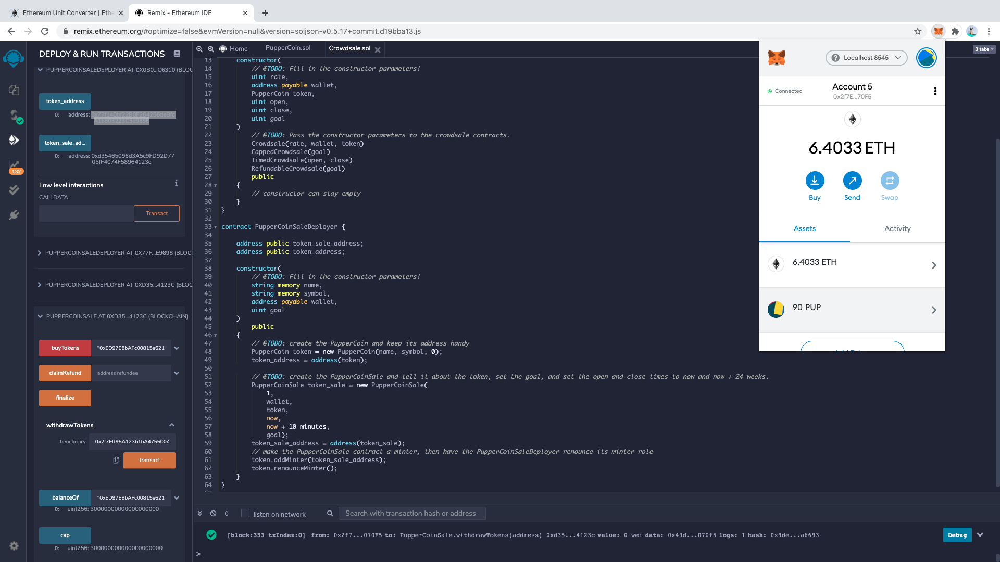
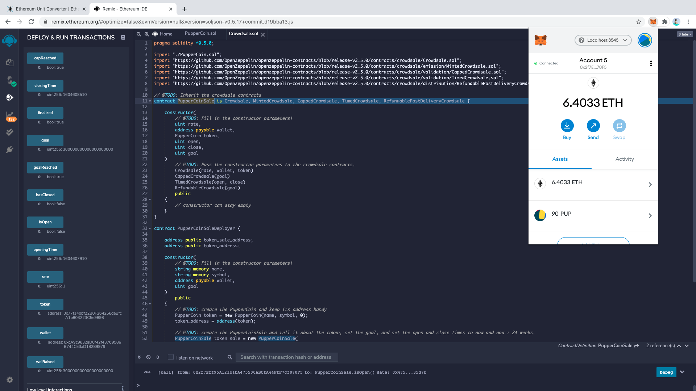
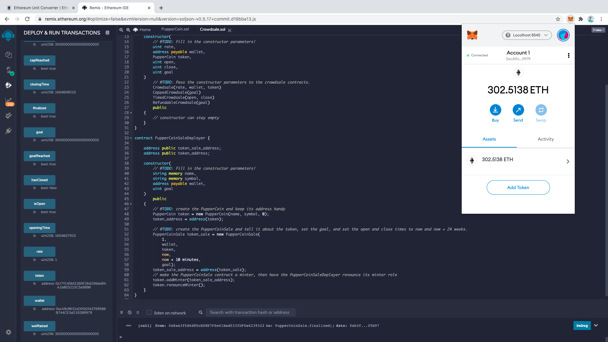

# Crowdsale the PupperCoin

## Background

To Crowdsale the PupperCoin token in order to help fund the network development that will be used to track the dog breeding activity across the globe in a decentralized way, and allow humans to track the genetic trail of their pets. 

It is required to enable refunds if the crowdsale is successful and the goal is met, which is to raise a maximum of 300 Ether. The crowdsale will run for 24 weeks.

It will need to create an ERC20 token that will be minted through a `Crowdsale` contract that can be leveraged from the OpenZeppelin Solidity library.

This crowdsale contract will manage the entire process, allowing users to send ETH and get back PUP (PupperCoin).
This contract will mint the tokens automatically and distribute them to buyers in one transaction.

It will need to inherit `Crowdsale`, `CappedCrowdsale`, `TimedCrowdsale`, `RefundableCrowdsale`, and `MintedCrowdsale`.

It will conduct the crowdsale on the a testnet in order to get a real-world pre-production test in.

## Instructions

### Creating the project

Using Remix, create a file called [PupperCoin.sol](Starter-Code/PupperCoin.sol) and create a standard `ERC20Mintable` token. 

Create a new contract named `PupperCoinCrowdsale` and prepare it like a standard crowdsale.

### Designing the contracts

#### ERC20 PupperCoin

Simply use a standard `ERC20Mintable` and `ERC20Detailed` contract, hardcoding `18` as the `decimals` parameter, and leaving the `initial_supply` parameter alone.

#### PupperCoinCrowdsale

Leverage the `Crowdsale` starter code, saving the file in Remix as [Crowdsale.sol](Starter-Code/Crowdsale.sol).

Bootstrap the contract by inheriting the following OpenZeppelin contracts:

* `Crowdsale`

* `MintedCrowdsale`

* `CappedCrowdsale`

* `TimedCrowdsale`

* `RefundablePostDeliveryCrowdsale`

Provide parameters for all of the features of the crowdsale, such as the `name`, `symbol`, `wallet` for fundraising, `goal`, etc. Feel free to configure these parameters.

If hardcode a `rate` of 1, it will maintain parity with Ether units (1 TKN per Ether, or 1 TKNbit per wei). If you'd like to customize your crowdsale rate, follow the [Crowdsale Rate](https://docs.openzeppelin.com/contracts/2.x/crowdsales#crowdsale-rate) calculator on OpenZeppelin's documentation. Essentially, a token (TKN) can be divided into TKNbits just like Ether can be divided into wei. When using a `rate` of 1, just like 1000000000000000000 wei is equal to 1 Ether, 1000000000000000000 TKNbits is equal to 1 TKN.

Since `RefundablePostDeliveryCrowdsale` inherits the `RefundableCrowdsale` contract, which requires a `goal` parameter, you must call the `RefundableCrowdsale` constructor from your `PupperCoinCrowdsale` constructor as well as the others. `RefundablePostDeliveryCrowdsale` does not have its own constructor, so just use the `RefundableCrowdsale` constructor that it inherits.

If forgot to call the `RefundableCrowdsale` constructor, the `RefundablePostDeliveryCrowdsale` will fail since it relies on it (it inherits from `RefundableCrowdsale`), and does not have its own constructor.

When passing the `open` and `close` times, use `now` and `now + 24 weeks` to set the times properly from the `PupperCoinCrowdsaleDeployer` contract.

#### PupperCoinCrowdsaleDeployer

This contract will model the deployment based off of the `ArcadeTokenCrowdsaleDeployer` built previously. Leverage the [OpenZeppelin Crowdsale Documentation](https://docs.openzeppelin.com/contracts/2.x/crowdsales) for an example of a contract deploying another, as well as the starter code provided in [Crowdsale.sol](Starter-Code/Crowdsale.sol).

### Testing the Crowdsale

To test the crowdsale, send Ether to the crowdsale from a different account (**not** the same account that is raising funds), then once you confirm that the crowdsale works as expected, try to add the token to MetaMask and test a transaction. You can test the time functionality by setting the `close` time to be `now + 10 minutes`, or whatever timeline you'd like to test for a shorter crowdsale.

When sending Ether to the contract, make sure you hit your `goal` that you set, and `finalize` the sale using the `Crowdsale`'s `finalize` function. In order to finalize, `isOpen` must return false (`isOpen` comes from `TimedCrowdsale` which checks to see if the `close` time has passed yet). Since the `goal` is 300 Ether, you may need to send from multiple accounts. If you run out of prefunded accounts in Ganache, you can create a new workspace.

The refund feature of `RefundablePostDeliveryCrowdsale` only allows for refunds once the crowdsale is closed **and** the goal is hit. See the [OpenZeppelin RefundableCrowdsale](https://docs.openzeppelin.com/contracts/2.x/api/crowdsale#RefundableCrowdsale) documentation for details as to why this is logic is used to prevent potential attacks on your token's value.

You can add custom tokens in MetaMask from the `Add custom token` feature.

#### Deploying the Crowdsale

Testing deployment the crowdsale to the Ganache testnet in the follwing order: (The procedures are the same to deploy to other network.) 

1. Open Ganache and MetaMask, connecting to the local network, and pre-fund the address if needed to ensure successful deployment of the contract as it would require some Gas.

2. Use the Deploy tab in Remix to deploy the  `PupperCoinSaleDeployer` contract. Store the deployed addresses for later. Parameters required: name of the token (`PupperCoin`), symbol (`PUP`), wallet (the `address` to fund), and goal (crowdsale cap `300 ETH`).

3. Load the `PupperCoinSale` and `PupperCoin` contracts via their deployed addresses from step 2 using the `At Address` feature in the `Deploy` tab of Remix.

4. Make a test purchase by setting the `value` field to some Ether value and calling the `buyTokens` function on the `PupperCoinSale` contract.

5. After the `goal` is hit, `isOpen` returning to false, `finalize` the sale using the `Crowsale`'s `finalize` functions.

6. After `finalize` the sale using the `Crowsale`'s `finalize` functions, view  purchased `PUP` Tokens on MetaMask wallet.  

6. MetaMask wallet would also give an overview of `ETH` and `PUP` token.

## Resources

* If you would like to see the parameters you need to pass to `Crowdsale` on-hand, visit the [OpenZeppelin API documentation](https://docs.openzeppelin.com/contracts/2.x/api/crowdsale#_core) for the details.

* The [Crowdsales Overview](https://docs.openzeppelin.com/contracts/2.x/crowdsales) page on OpenZeppelin's documentation also serves as a good resource for how crowdsales work in detail, and the nuances of different implementations provided.
